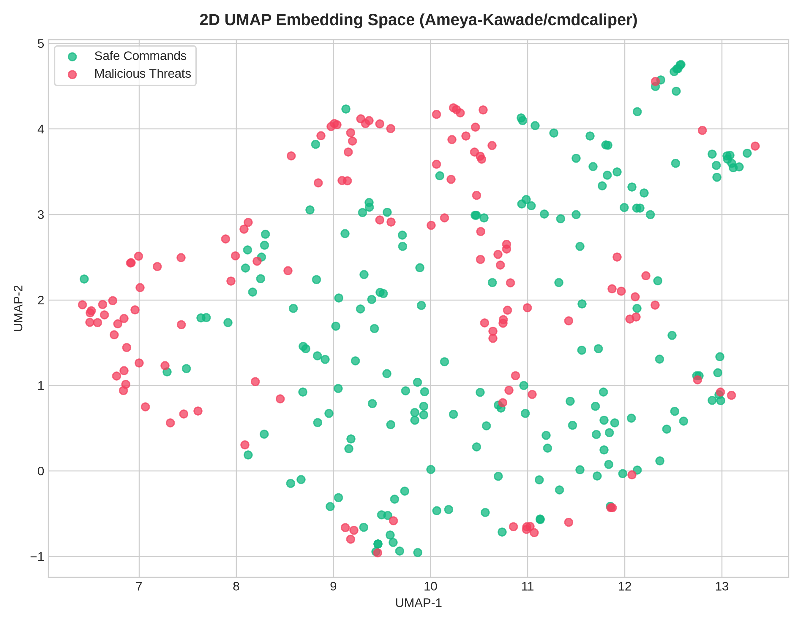
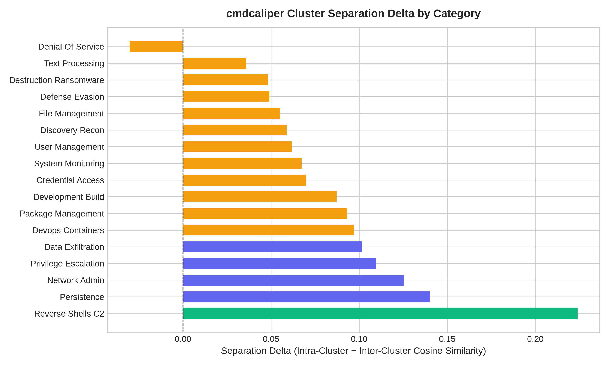

# 🌐 Linux Command Intent Engine (Web Edition)

> **Modern Web-Based AI Pre-Flight Shell Safety & Intent Interceptor with Live Terminal Streaming, SafeCmd AST Validation, Explainshell & man7.org Manpages, and Docker eBPF Sandbox Integration**

The **Web Edition** of the Linux Command Intent Engine provides a completely standalone, full-fidelity web application built on **FastAPI**, **React**, **Vite**, **Xterm.js**, and **TailwindCSS**.

---

## ✨ Key Features

- 🛡️ **Full Multi-Tool Pre-flight Pipeline:**
  - **SafeCmd AST & Policy Sandbox:** Pipeline decomposition and allowlist validation, now supporting complex multi-line bash scripts and compound commands.
  - **CmdCaliper Vector Safety:** High-speed semantic similarity threat detection.
  - **CmdCaliper Vector Space Visualization:** Integrated analytics dashboard plotting fine-tuned embeddings in 2D/3D to visually isolate dangerous command clusters.
  - **Explainshell Database & man7.org:** GNU / Linux ground-truth synopsis, interactive flag cards, and man7.org integration for official manpage definitions.
  - **Rule Heuristics:** Destructive regex patterns, privilege escalations (`sudo`), and mutation risks.
  - **SLM / LLM Semantic Reasoning:** Configurable multi-provider support including OpenRouter (Gemini / Claude), Google Gemini, OpenAI, Ollama (Phi-4-mini / Qwen), or offline heuristics.
- 📊 **Rich Interactive Impact Assessment Card:**
  - Dynamic risk classification (`[SAFE]`, `[CAUTION]`, `[CRITICAL]`) with glowing pulse animations.
  - Reversibility badges (`[REVERSIBLE]` vs `[IRREVERSIBLE]`).
  - Interactive AST pipeline tree flow and redirection targets.
  - Filesystem mutations breakdown (`+ [CREATE]`, `~ [MODIFY]`, `- [DELETE]`).
  - Network footprint & listening ports breakdown.
  - One-click copyable safer alternative suggestions.
- ⚡ **Real-Time Streaming Terminal (`xterm.js`):**
  - Live stdout/stderr ANSI streaming over WebSockets.
  - Real-time CWD tracking and directory synchronization.
  - Process abortion (`Ctrl+C` / SIGINT & SIGKILL support).
  - Exit code badges and millisecond execution telemetry.
- 🐳 **Dual Execution Modes:**
  - **Local Host Execution:** Real-time subprocess execution directly on the host machine.
  - **Docker Sandbox Execution:** Isolated, traced execution using eBPF Tracee within a Docker container.
- 📜 **Telemetry & Audit Drawer:**
  - Comprehensive history feed for all executed commands.
  - Risk-level filtering and search capabilities.
  - Fast recall for rerunning past commands.

---

## 🏗️ Architecture

The application is structured into a modern client-server architecture:

- **Backend (FastAPI):** Orchestrates the multi-tool pipeline, manages the SQLite/Vector databases, communicates with AI providers, and handles execution streams (host and sandbox).
- **Frontend (React + Vite):** A highly responsive, glassmorphic UI offering a cyberpunk aesthetic. Features interactive state machines for command ingestion, analysis, confirmation, and live execution.
- **Script Executor:** A dedicated service for securely parsing and executing complex bash scripts.

## 🚀 Getting Started

1. **Install Dependencies:**
   - `npm install` (Frontend)
   - `pip install -r requirements.txt` (Backend)
2. **Run the Application:**
   - Use the provided start script: `./start.sh dev`
3. **Configure Providers:**
   - Access the Settings Modal in the UI to set up API keys for your preferred LLM providers (Gemini, OpenRouter, OpenAI, Ollama).

## 🧠 Model Fine-Tuning & Dataset (CmdCaliper)

The engine's semantic search relies on a fine-tuned embedding model based on the **CmdCaliper (EMNLP 2024)** architecture.

### 🌌 Model Visualizations
Below are the generated vector space projections separating safe vs. destructive Linux commands:

### Datasets Used
- **CyPHER Dataset Chunks:** Custom context-aware contrastive learning datasets of Linux commands generated via LLM.
- **Hugging Face Hub Datasets:** 
  - `westenfelder/NL2SH-ALFA`
  - `poppaea/Linux_Command_Classification`
  - `aelhalili/bash-commands-dataset`
- **Kaggle Datasets:**
  - `cyberprince/linux-and-windows-privilege-escalation-dataset`
  - `cyberprince/linux-terminal-commands-dataset`
- **cmdcaliper_corpus.json & cmdcaliper_vectors.npz:** Pre-computed embeddings corpus used by the vector database for real-time similarity search.
- **Explainshell SQLite Database & man7.org Pages:** Ground-truth Linux manpage definitions and man7.org pages used for augmenting intent with factual flag descriptions.

### Techniques Used
- **Synthetic Data Generation:** A **dual-LLM pipeline** splitting workload between the Groq API and local Ollama (`qwen2.5-coder:7b`) on GPUs to generate command pairs.
- **Automated Verification:** Bash syntax correctness verification (`bash -n`) paired with a semantic parity check via local LLM judges.
- **Contrastive Learning:** Fine-tuning embedding models using **InfoNCE Loss** (temperature τ = 0.05), L2 normalization, and CosineAnnealing.
- **Vector Space Analysis:** Using **CSEBert Masked-Mean Pooling** and semantic similarity search to flag dangerous intents based on vector proximity.
- **Multithreaded Categorization:** Concurrent inference via local Ollama daemons across Dual Kaggle GPUs for rapid dataset annotation.
- **Stability Safeguards:** Implementation of gradient clipping (`max_norm=1.0`) and normalized similarity matrices to ensure PyTorch stability during training.
- **Vector Space Visualization:** An integrated visualization dashboard (`trained_cmdcaliper_output_visualize`) that plots the fine-tuned command embeddings in semantic vector space to visually isolate and analyze dangerous command clusters.
